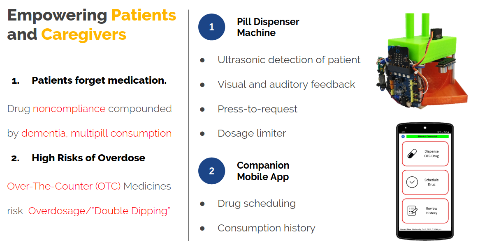

MedACS (Medicine Automated Control System) is an integrated medication scheduling, provision and reminder system designed to reduce the burden on stay-at-home caregivers and patients by eliminating medicinal nonadherence and protecting users from accidental overdose. Working with a smartphone app, MedACS supersedes existing systems by remotely and automatically tabulating and scheduling pill dispensal. 

MedACS comprises two components: A Companion Smartphone App allows caregivers to remotely input medical information, while an Automated Pill Dispenser monitors consumption patterns and noncompliance, detecting when and if patients take the dispensed medication to alert caregivers to irregularities. To safeguard patients from overdosing on Over-The-Counter (OTC) medication, MedACS is also equipped with an adjustable safeguard, utilising the integrated display to provide visual and aural cues.  

