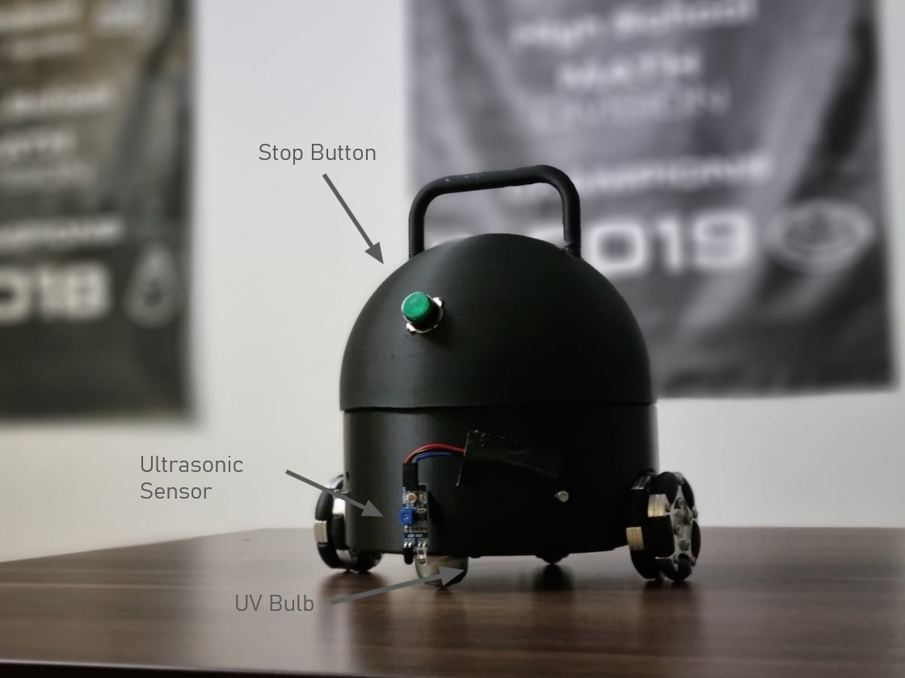
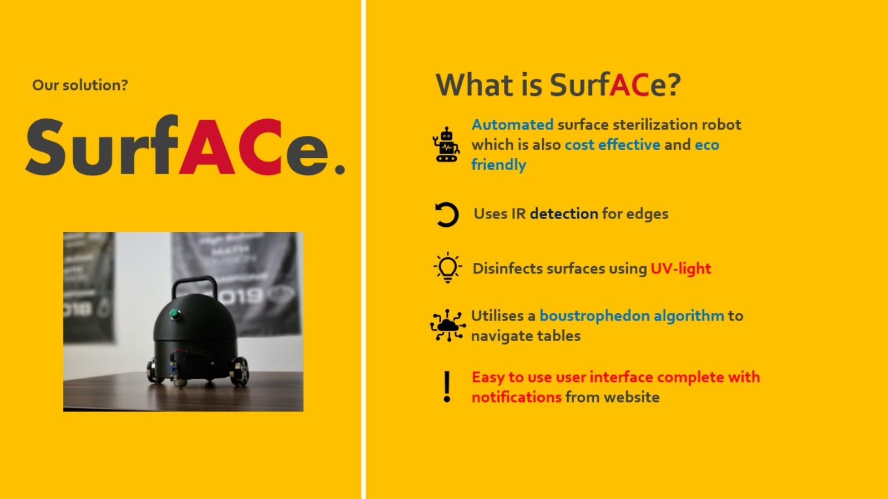

SurfACe is an automated surface sterilisation robot, developed in response to growing concern over the sanitization of public spaces, especially with incewased emphases during the current COVID-19 pandemic. Made to be simple and intuitive to use, this robot reduces manpower and resources needed for surface sanitisation, as well as being environmentally friendly

SurfACe disinfects surfaces through the use of a contained UV light bulb, shielding any harmful effects, which is particularly useful from home to public areas. On tables, it has ultrasonic detection for the corners, and is also inexpensive and easily constructed, being 3D printed and utlizing easily obtainable electronics. An integrated web server with remote control also notifies the user when the robot is finished cleaning.

