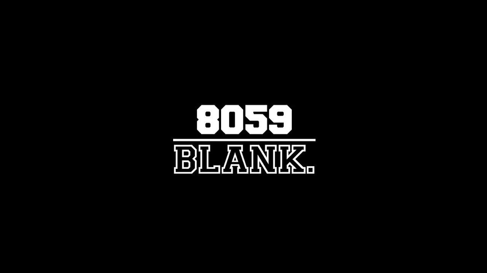

## Robotics

{:width="500px"}

Established in 2006, 8059 Blank. is a robotics team from Anglo-Chinese School (Independent) based in Singapore. We have been actively competing in VEX Robotics Competitions as well as taking part in other various competitions, such as RoboCup and FIRST Global. 

 

## Coding Competition Team

{:width="500px"}

Our Coding Competition Team specialises in everything involving code. We pride ourselves in our eagerness to learn, explore, and apply our knowledge in various fields. Some of the things we do include Competitive Programming, Software Engineering, and Artificial Intelligence amongst others...

 

## TechSquad

{:width="500px"}

Tech Squad specialises in designing and creating tangible products for a wide range of competitions revolving around the theme of technology. We fabricate our products meticulously using computer-aided designs (CAD) and bring them to life with the assistance of 3D-printers. We also prototype and develop a multitude of apps for both iOS and Android. Our responsibilities include running the Digital Maker’s Zone (DMZ) in Anglo-Chinese School (Independent) which is the first student-run hub for innovation and tinkering in Singapore.
